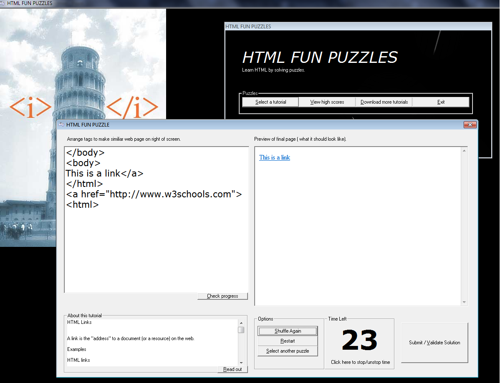

# HTML FUN PUZZLES

It was an academic project developed by me in the last decade rediscovered recently from an old backup CD and now uploaded here as an archive.

## Basic Idea

Idea of the game is simple, sort HTML tags in correct order. Each tag and tutorial will also have explanation about itself.

## Screenshot

## Packaging

Installer created using "Inno setup". Check release section for exe.

## License

This project is licensed under the MIT License - see the [LICENSE.md](LICENSE.md) file for details

